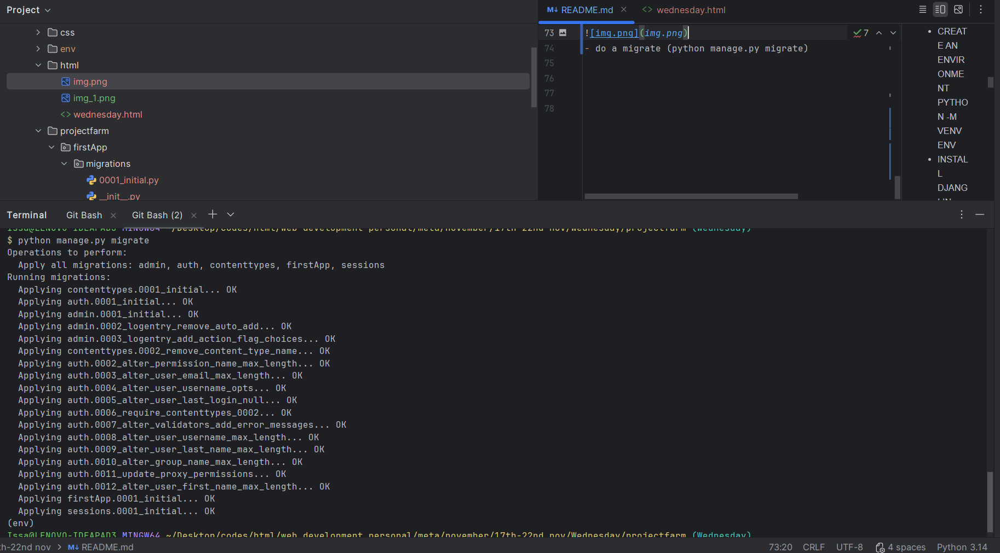
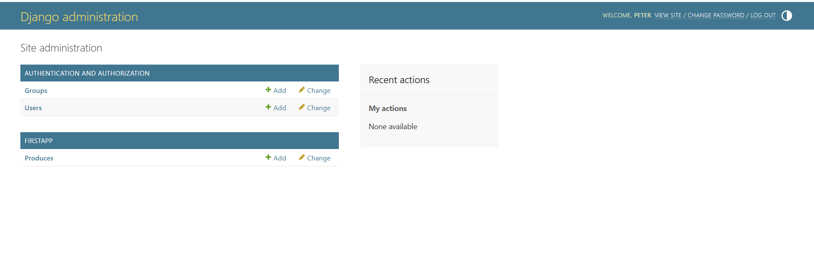
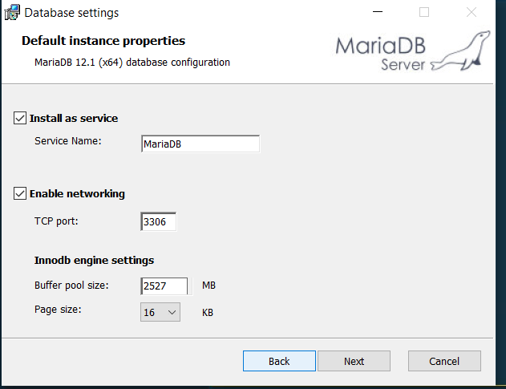

# 17th-to-22nd-november
everything that happened during this time
Django Learning Project

⚡ Key Concepts
Backend Architecture

Client: Sends requests to the server

Server: Processes requests and returns responses (HTTP)

Database: Stores and retrieves data via queries

Web Communication

TCP/IP, DNS, HTTP, and server-side files

Templates and views for dynamic content

Django Framework

MVT Structure (Model-View-Template):

Model: Database representation (ORM)

View: Handles data processing

Template: Renders user interface
Educational project to understand backend workflows and Django MVT structure.

Illustrates server-client interaction, templates, and database queries.

Includes external references for deeper learning.

        TUESDAY
- CREATE AN ENVIRONMENT PYTHON -M VENV ENV
- INSTALL DJANGI IN THE ENVIRONMENT PIP INSTALL DJANGO
- CREATE A PROJECT django-admin startproject projectlemma
        - manage.py handles our running
        - wsgi and asgi  deals with the web configuration
        - __init__ tell program you are dealing with a python module
        - settings is for configuration
        - urls is the endpoint, checks the route
- CHECK THE FOLDER YOU ARE IN AND RUNSERVER OF MANAGE.PY
- create an application.ensure you are in the same directory as manage.py
- CREATE AN APP python manage.py startapp firstApp
- CREATE VIEWS 
- CREATE URLS
- go and add include and the path to the first path in projects urls

- lastly add the name to setting
- run server to see the update (python manage.py runserver)

        WEDNESDAY
- activate environment
- install django
- create django project
- run project and confirm your directory
- stops first url then the view
- select inteprator
- create an application
- register the application of the project in the settings
- put the path in the urls part
- create the first paths
- Next we gonna see about models. in vs code download sqlite viewer
- create a schemer in models
- in models we create the model
            -class Produce(models.Model):  #name of the table
    -name = models.CharField(max_length=200)  #string
    -price = models.IntegerField()  #numbers
- make migrations next (python manage.py makemigrations)

- do a migrate (python manage.py migrate)

### - removing file use rm -rf .git ###

- create an admin by creating a super user(python manage.py createsuperuser)
- 
- navigate to '/admin' endpoint
- register our product to the admin (admin.site.register(models.Produce))
- 

- display data on template
- We will start this on thursday

                    THURSDAY
- A QUICK RECAP OF WEDNESDAY WHILE 
- 
- DOWNLOADING DATAMARIA FOR THE DATABASE
- 
- add templates in app
- in templates inClude html file or a folder where the file will reside
- in views return render(request, 'Mkdir(folder)/main.html')
- in setting tembplate include the template 

-in the file
- ginger callibrasing. adding an external html file in th e template html
in the main to link route use the ginger calibrasing \
''''
- {% url 'home%'}--> this is an eexample
''''
- 
    
-  to incoporate the html file format
-   to add content
  -      to close content
- decoupling the app related templates
- this is done by creating app subfolder  inside the templates directory in project
- 
- 

